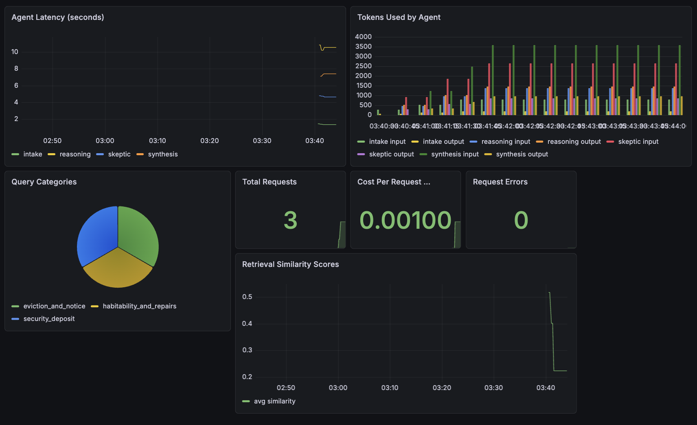

# TenantIQ

An AI-powered tenant rights advisor for Pennsylvania renters, built with 
RAG (Retrieval Augmented Generation) using the Claude API and Chroma.

## What It Does

TenantIQ helps renters understand their legal rights in plain language.
Users describe their situation conversationally and receive grounded,
cited answers based on real Pennsylvania landlord-tenant law — not
hallucinated general knowledge.

## How It Works

- **Knowledge base**: Pennsylvania Landlord Tenant Act, PA Attorney General 
  Tenant Rights Guide, and Neighborhood Legal Services handbook — fetched 
  directly from source URLs, chunked, embedded, and stored in Chroma
- **Retrieval**: Semantic similarity search surfaces the most relevant legal 
  passages for each query, with similarity-based deduplication to ensure 
  distinct sources
- **Generation**: Claude answers exclusively from retrieved context, with 
  source citations and legal disclaimer
- **Context-aware follow-ups**: Vague follow-up questions are automatically 
  enriched with conversation context before retrieval using word-boundary 
  matching

## Tech Stack

- Claude API (Anthropic) — reasoning and generation
- Chroma — local vector database for persistent embeddings
- sentence-transformers (all-MiniLM-L6-v2) — local embedding model
- LangChain — recursive character text splitting
- BeautifulSoup + pypdf — document loading from URLs
- Python

## Setup
```bash
pip install anthropic chromadb sentence-transformers langchain \
            requests beautifulsoup4 pypdf python-dotenv
```

Create a `.env` file with your Anthropic API key:

Build the knowledge base (fetches documents automatically from source URLs):
```bash
python build_kb.py
```

Run the advisor:
```bash
python tenantiq.py
```

## Example Interactions

**Security deposit:**
> "My landlord hasn't returned my deposit after 45 days"
→ Cites 30-day return requirement, explains double damages remedy, 
  references PA Landlord Tenant Act Section 512

**Landlord entry:**
> "Can my landlord enter my apartment without telling me?"
→ Explains quiet enjoyment rights, 24-hour notice requirement, 
  emergency exceptions

**Context-aware follow-up:**
> "What should I do if they do it again?"
→ Correctly understands "they" refers to the landlord from prior 
  context, retrieves relevant chunks without asking for clarification

## Business Context

44 million renter households in the US face legal situations they
cannot afford to resolve — 97% of tenants go unrepresented while
nearly all landlords have legal counsel. TenantIQ addresses this
access gap by making legal knowledge instantly accessible.

Primary B2B customers: legal aid organizations and city housing
authorities, who currently spend ~$400 per case on manual intake
that TenantIQ automates at near-zero marginal cost.

## Current Limitations and Next Steps

- Scoped to Pennsylvania law only (Pittsburgh focus)
- Terminal interface — Streamlit UI in progress
- Expanding to additional jurisdictions via Pinecone for production scale

## Roadmap

**In progress:**
- Streamlit web UI replacing the terminal interface
- Exit/command handling improvements
- Response conciseness tuning

**Planned:**
- Pinecone migration for multi-state deployment
- Jurisdiction detection so users don't need to specify their state
- Evaluation framework — ground truth test set with accuracy scoring
- Legal aid organization integration for case intake handoff

**Known limitations:**
- Pennsylvania law only (Pittsburgh focus for MVP)
- Knowledge base reflects documents as of April 2026 — 
  legal updates require rebuilding the index
- Not a substitute for legal advice — designed to triage 
  and inform, not replace an attorney

## Planned Feature: Lease Analysis

Users will be able to upload their lease PDF directly to TenantIQ 
for plain-language analysis before signing.

**How it will work:**
1. User uploads lease PDF
2. Text is extracted locally using pypdf
3. PII is automatically scrubbed before anything is sent to the AI —
   addresses, phone numbers, emails, and names are replaced with 
   redaction tags using regex pattern matching and named entity recognition
4. Scrubbed text is sent to Claude for analysis
5. Claude flags unusual clauses, hidden fees, rights being waived, 
   and anything worth negotiating

**Privacy approach:**

TenantIQ implements a two-layer privacy model:
- **Automated scrubbing** — structured PII (addresses, phone numbers, 
  SSNs, emails) removed by regex; names and locations removed by NER 
  (spaCy) before any text reaches the API
- **User self-redaction** — users are explicitly encouraged to manually 
  black out their name and address before uploading as a second 
  independent layer of protection

The goal is not to ask users to trust us — it is to give them the 
tools to verify their own privacy. This reflects a privacy-by-design 
approach where protections are built into the architecture rather 
than added as an afterthought.


## Evaluation Results

Evaluated against 25 curated question/answer pairs drawn from PA statutes.
Scoring via LLM-as-judge (Claude evaluating correctness, citation accuracy, hallucination).

| Metric | Score |
|---|---|
| Answer accuracy | 96.0% |
| Citation accuracy | 80.0% |
| Hallucination rate | 4.0% |
| Mean latency (p50) | 24.2s |
| Mean latency (p95) | 29.9s |

**By category:**

| Category | Score |
|---|---|
| Security deposit | 6/6 (100%) |
| Eviction and notice | 5/5 (100%) |
| Habitability and repairs | 2/2 (100%) |
| Tenant retaliation | 2/2 (100%) |
| General rights | 6/6 (100%) |
| Lease terms | 2/2 (100%) |
| Landlord entry | 1/2 (50%) |

**Known limitations:** 24s median latency is a direct consequence of 5 sequential 
LLM calls in the multi-agent pipeline. Intake and skeptic agents have been routed 
to a faster model tier to reduce overhead. Landlord entry (50%) is the weakest 
category — a known gap in the current knowledge base being addressed in the next 
iteration. Citation accuracy (80%) reflects cases where the correct legal conclusion 
is reached but sourced from an alternative authoritative document rather than the 
primary expected statute.


## Observability

TenantIQ exposes a `/metrics` endpoint scraped by Prometheus every 15 seconds. 
A Grafana dashboard visualizes agent-level latency, token usage, query category 
distribution, retrieval similarity scores, and cost per request in real time.

Bring up the full observability stack with one command:
```bash
docker-compose up
```

